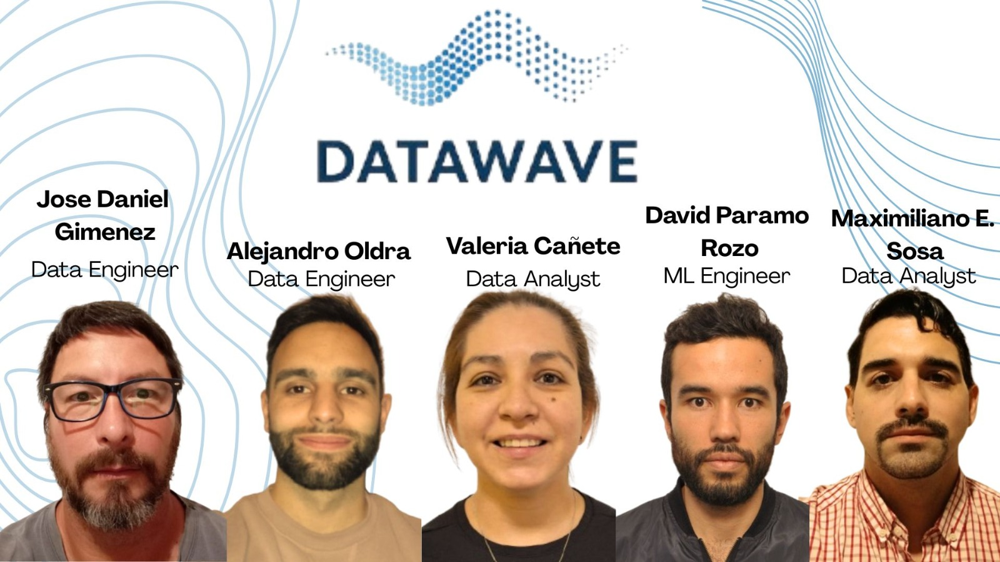

# Proyecto grupal
## YELP & GOOGLE MAPS - REVIEWS AND RECOMMENDATIONS

## Índice
- [Descripción del Proyecto](#descripción-del-proyecto--localización-óptima-y-análisis-de-éxito-gastronómico)
- [Presentación del equipo](#presentación-del-equipo)
- [Objetivos del proyecto](#objetivos-del-proyecto)
- [Alcance](#alcance)
- [Motivos para la elección del alcance del proyecto](#motivos-para-la-elección-del-alcance-del-proyecto)
- [Pipeline END to END](#pipeline-end-to-end)
- [Tecnologías y herramientas utilizadas](#tecnologías-y-herramientas-utilizadas)
- [Key Performance Indicators (KPI)](#key-performance-indicators-(kpi))
- [Metodología de Trabajo: SCRUM](#metodología-de-trabajo:-scrum)

## Descripción del Proyecto – *Localización Óptima y Análisis de Éxito Gastronómico*

**Empresa: DataWave. Data Solutions**

### Problemática

Un cliente con capital disponible desea iniciar un emprendimiento gastronómico en los Estados Unidos. Su objetivo es maximizar las posibilidades de éxito desde el inicio, seleccionando:

1. **El estado más favorable demográficamente**, considerando la **mayor densidad poblacional**.
2. **La categoría de restaurante con mayores probabilidades de éxito**, determinada a partir de **reseñas reales de clientes**.

### Solución Propuesta

Desde **DataWave Data Solutions**, desarrollamos una solución integral basada en ciencia de datos, que combina datos demográficos oficiales con análisis inteligente de reseñas en línea.

#### 1. Análisis Demográfico
Usamos datos del **U.S. Census Bureau** para identificar el **estado con mayor densidad poblacional**. Esta métrica permite enfocar el análisis en zonas con alta concentración de personas, lo que incrementa la visibilidad y potencial de captación de clientes.

#### 2. Análisis de Reseñas y Tendencias Gastronómicas
Utilizando datasets de **Google Maps** y **Yelp**, realizamos:
- Clasificación por categoría gastronómica
- Análisis de sentimientos sobre reseñas
- Identificación de categorías con mayor proporción de reseñas positivas

### Beneficios para el Cliente

- ✅ **Ubicación estratégica:** seleccionada con base en datos reales de población.
- ✅ **Reducción de riesgo:** mediante decisiones fundamentadas en datos de comportamiento y opinión del consumidor.
- ✅ **Recomendación personalizada:** del tipo de restaurante más prometedor, alineado con preferencias del mercado.

## Presentación del equipo



## Objetivos del proyecto

- Predecir los rubros con mayor crecimiento o declive
- Identificar mejores ubicaciones según densidad y demanda
- Implementar un sistema de recomendación personalizado
- Generar dashboards claros y accionables
- Desarrollar un sistema que actualice reseñas automáticamente

## Alcance

El presente proyecto contempla, en su fase inicial, la recolección, limpieza y análisis de datos demográficos y comerciales con el objetivo de identificar el estado de mayor potencial para la apertura de un primer local gastronómico. Esta selección se basará en indicadores como la densidad poblacional, características socioeconómicas y preferencias de consumo. De forma complementaria, se analizarán reseñas y puntuaciones de restaurantes a nivel nacional para determinar la categoría gastronómica con mayores probabilidades de éxito, utilizando técnicas de análisis de sentimientos y minería de texto.

Esta primera implementación funcionará como prueba piloto, permitiendo validar hipótesis comerciales y operativas en un entorno real.

En una segunda etapa, ya contemplada en la planificación futura del proyecto, se prevé el desarrollo e implementación de un sistema de recomendación basado en aprendizaje automático. Este modelo permitirá escalar la estrategia de expansión, identificando nuevas ubicaciones óptimas para la instalación de sucursales en otros estados del país, en función de patrones demográficos, comportamientos de consumo y desempeño del local inicial.

## Motivos para la elección del alcance del proyecto

1. **Reducción de riesgos en la inversión inicial:** Iniciar con una única ubicación permite evaluar la viabilidad del emprendimiento con una inversión controlada, reduciendo el riesgo financiero antes de escalar el modelo a otros estados.
2. **Validación del modelo de análisis:** Esta primera fase permite comprobar la efectividad del enfoque analítico propuesto (demografía + análisis de reseñas), asegurando que las herramientas y métodos empleados son adecuados antes de su aplicación a gran escala.
3. **Facilidad de implementación:** Concentrarse en un único local piloto permite una mayor supervisión y control de los procesos operativos, logísticos y comerciales, facilitando ajustes en tiempo real según el comportamiento del mercado.
4. **Obtención de datos reales para feedback:** El funcionamiento del local inicial generará datos propios (ventas, satisfacción de clientes, preferencias locales) que servirán para entrenar y ajustar el futuro modelo de recomendación.
5. **Estrategia de expansión progresiva:** Este enfoque gradual facilita el diseño de una hoja de ruta basada en evidencias, permitiendo escalar el negocio de manera sostenible y con fundamentos sólidos.
6. **Optimización de recursos técnicos:** Al limitar el análisis inicial a un estado y un rubro específico, se permite una investigación más profunda y detallada, maximizando la calidad de los insights sin dispersar los recursos del equipo.
7. **Mayor claridad para la toma de decisiones:** Un alcance acotado ayuda a mantener el foco en objetivos concretos, facilitando la toma de decisiones informadas y medibles en el corto plazo.

## Pipeline END to END

### Resumen del flujo de datos optimizado

```
[Extracción API / JSON]
        ↓
[Ingesta a GCS (raw layer)]
        ↓
[Cloud Composer (Airflow) ejecuta limpieza]
        ↓
[Cloud Functions o Dataflow realiza transformación]
        ↓
[BigQuery (staging → model layer)]
        ↓
[Jupyten Notebook / Colab para EDA, NLP y ML]
        ↓
[Modelo deploy: Cloud Run o Vertex AI Endpoint]
        ↓
[Dashboard: Power BI]
```

### Etapas y servicios recomendados

#### 1. Ingesta de datos → Google Cloud Storage (GCS)
- Objetivo: almacenar datos crudos
- Herramientas: Cloud Functions, Airflow, GCS buckets

#### 2. Limpieza básica → Cloud Composer (Airflow)
- Orquestación con DAGs personalizados

#### 3. Transformación avanzada → Cloud Functions o Cloud Dataflow
- Scripts ligeros (Functions) o flujos pesados (Dataflow/Apache Beam)

#### 4. Almacenamiento → BigQuery
- Modelo estrella o snowflake: `fact_reviews`, `dim_business`, etc.

#### 5. EDA y NLP → Google Colab o Vertex AI Workbench
- Librerías: pandas-gbq, nltk, vader, etc.

#### 6. Machine Learning → Vertex AI
- Entrenamiento, validación y deploy de modelos

#### 7. Deploy del producto → Cloud Run o Vertex AI Endpoint
- Streamlit App o API REST (FastAPI)

#### 8. Dashboard final → Power BI

### Automatización con Airflow (Composer)

1. Ingestar archivo JSON
2. Limpiar con Cloud Function
3. Cargar en BigQuery
4. Transformar a capa modelada
5. Ejecutar modelo y actualizar salida


## Tecnologías y herramientas utilizadas

| Tecnología / Servicio     | Categoría              | Función en el pipeline                                                                 |
|---------------------------|------------------------|----------------------------------------------------------------------------------------|
| Google Cloud Storage      | Almacenamiento         | Repositorio de datos crudos y preprocesados                                           |
| Cloud Composer            | Orquestación           | Orquestador de procesos ETL con Apache Airflow                                        |
| Cloud Functions           | Procesamiento ligero   | Funciones para limpieza y transformación sin servidor                                 |
| Cloud Dataflow            | Procesamiento escalable| Para cargas grandes o procesamiento en streaming                                      |
| BigQuery                  | Data Warehouse         | Consulta rápida sobre grandes volúmenes, con modelo estructurado                     |
| BERT / XGBoost            | Machine Learning       | Entrenamiento, validación y despliegue de modelos                                     |
| Power BI                  | Visualización          | Dashboards interactivos conectados directamente a BigQuery                           |


## Key Performance Indicators (KPI)

A continuación se describen los KPIs clave definidos para evaluar tendencias, oportunidades de mercado y efectividad del modelo en el proyecto.

---

### KPI 1: Índice de Potencial Demográfico por Estado

**Objetivo:** Priorizar geográficamente los estados con mayor atractivo para instalar un local gastronómico, considerando densidad poblacional y condiciones socioeconómicas.

**Fórmula sugerida (ponderada):**
```
Índice = (Densidad poblacional normalizada × 0.5) +
         (Ingreso promedio normalizado × 0.3) +
         (Porcentaje de educación superior × 0.2)
```

**Periodicidad:** Evaluación puntual anual o semestral.

**Interpretación:** Un valor más alto indica mayor potencial de éxito para nuevos negocios en ese estado.

---

### KPI 2: Satisfacción del Cliente en Relación a Reseñas

**Objetivo:** Identificar estados con alto volumen de reseñas pero bajo rating promedio, lo que puede indicar oportunidades para mejorar la oferta gastronómica.

**Fórmula sugerida:**
```
Índice de insatisfacción = log10(N° de reseñas + 1) × (5 - Rating promedio)
```
**Ejemplo**

| Estado     | N° Reseñas | Rating Promedio | Índice |
|------------|------------|------------------|--------|
| Texas      | 120,000    | 3.2              | 2.3    |
| Florida    | 80,000     | 4.1              | 1.0    |

**Interpretación:** Estados con mayor índice presentan mayor concurrencia y menor satisfacción → alto potencial de inversión.

---

### KPI 3: Tendencia de Crecimiento en Subcategorías

**Objetivo:** Detectar subcategorías gastronómicas que presentan un crecimiento en la densidad de reseñas entre trimestres consecutivos.

**Fórmula:**
```
Densidad = N° de reseñas del trimestre / N° de negocios activos
Tendencia = ((Densidad actual - Densidad anterior) / Densidad anterior) × 100
```
**Ejemplo**

| Subcategoría | Densidad Q1 | Densidad Q2 | Crecimiento (%) |
|--------------|-------------|-------------|------------------|
| Tacos        | 20.0        | 26.0        | +30.0%           |
| Sushi Bar    | 20.0        | 19.4        | –3.0%            |

**Interpretación:** Subcategorías con tendencia positiva representan oportunidades emergentes para diversificar la inversión.

---

## Metodología de Trabajo: SCRUM

Para el desarrollo del proyecto se adoptó la metodología ágil **SCRUM**, orientada a maximizar la colaboración en equipo, la adaptabilidad al cambio y la entrega incremental de valor.

### ¿Qué es SCRUM?

SCRUM es un marco de trabajo ágil que permite gestionar proyectos complejos de forma eficiente mediante iteraciones cortas llamadas **sprints**, promoviendo la mejora continua y la rápida entrega de productos funcionales.

### Estructura del equipo SCRUM

- **Product Owner (PO):** Representa los intereses del cliente. Define prioridades, valida entregables y ajusta el backlog según las necesidades del negocio.
- **Scrum Master:** Facilita el proceso SCRUM, remueve obstáculos y asegura el cumplimiento de la metodología.
- **Equipo de desarrollo:** En este caso, compuesto por:
  - 2 Data Engineers
  - 2 Data Analysts
  - 1 ML Engineer

### Artefactos SCRUM

- **Product Backlog:** Lista priorizada de tareas y funcionalidades necesarias para cumplir los objetivos del proyecto.
- **Sprint Backlog:** Subconjunto del Product Backlog seleccionado para trabajarse durante un sprint.
- **Incremento:** Resultado funcional del sprint que puede presentarse al PO.

### Ceremonias SCRUM utilizadas

| Ceremonia         | Frecuencia      | Descripción |
|-------------------|-----------------|-------------|
| Sprint Planning   | Al inicio de cada sprint | El equipo define qué tareas se van a realizar y cómo. |
| Daily Scrum       | Diariamente     | Reunión de 15 minutos para revisar avances, obstáculos y plan diario. |
| Sprint Review     | Fin del sprint  | Se muestra el trabajo completado al Product Owner. Se recibe feedback. |
| Sprint Retrospective | Fin del sprint | Reflexión sobre el proceso, identificando mejoras para el próximo sprint. |

### Estructura de trabajo en el proyecto

- Duración del proyecto: **6 semanas**
- Dividido en **3 sprints** de 2 semanas cada uno
- Entregables definidos por sprint, validados con el PO
- Gestión de tareas y seguimiento mediante tableros (Kanban en GitHub Projects o Trello)

### Beneficios obtenidos

- Claridad de roles y prioridades
- Mejora continua en cada sprint
- Capacidad de adaptación ante cambios de requerimientos
- Trabajo colaborativo y transparente
